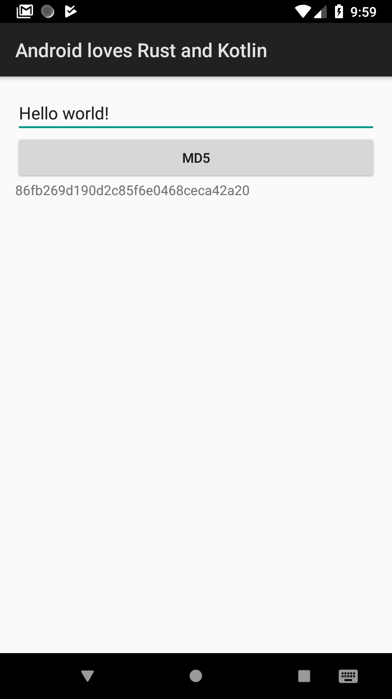

Sample project to show how to code Android with Kotlin and Rust



### Prerequisites

In order to build project, you need:

0. Setup rust with all targets:
```
rustup target add armv7-linux-androideabi   # for arm
rustup target add i686-linux-android        # for x86
rustup target add aarch64-linux-android     # for arm64
rustup target add x86_64-linux-android      # for x86_64
```
1. Setup NDK
2. Make standalone toolchain:
```
mkdir NDK
${NDK_HOME}/build/tools/make_standalone_toolchain.py --api 26 --arch arm64 --install-dir NDK/arm64
${NDK_HOME}/build/tools/make_standalone_toolchain.py --api 26 --arch arm --install-dir NDK/arm
${NDK_HOME}/build/tools/make_standalone_toolchain.py --api 26 --arch x86 --install-dir NDK/x86
${NDK_HOME}/build/tools/make_standalone_toolchain.py --api 26 --arch x86_64 --install-dir NDK/x86_64
```
3. Provide path of NDK to gradle. For example, you could use env:
```
ANDROID_NDK_TOOLCHAIN_DIR=~/NDK ./gradlew assembleDebug
```

### More info

- [rust-android-gradle plugin](https://github.com/ncalexan/rust-android-gradle)
- [more explanation, how to use Rust for Android](https://mozilla.github.io/firefox-browser-architecture/experiments/2017-09-21-rust-on-android.html)

### License

```
MIT License

Copyright (c) 2018 Andrius Semionovas

Permission is hereby granted, free of charge, to any person obtaining a copy
of this software and associated documentation files (the "Software"), to deal
in the Software without restriction, including without limitation the rights
to use, copy, modify, merge, publish, distribute, sublicense, and/or sell
copies of the Software, and to permit persons to whom the Software is
furnished to do so, subject to the following conditions:

The above copyright notice and this permission notice shall be included in all
copies or substantial portions of the Software.

THE SOFTWARE IS PROVIDED "AS IS", WITHOUT WARRANTY OF ANY KIND, EXPRESS OR
IMPLIED, INCLUDING BUT NOT LIMITED TO THE WARRANTIES OF MERCHANTABILITY,
FITNESS FOR A PARTICULAR PURPOSE AND NONINFRINGEMENT. IN NO EVENT SHALL THE
AUTHORS OR COPYRIGHT HOLDERS BE LIABLE FOR ANY CLAIM, DAMAGES OR OTHER
LIABILITY, WHETHER IN AN ACTION OF CONTRACT, TORT OR OTHERWISE, ARISING FROM,
OUT OF OR IN CONNECTION WITH THE SOFTWARE OR THE USE OR OTHER DEALINGS IN THE
SOFTWARE.
```
